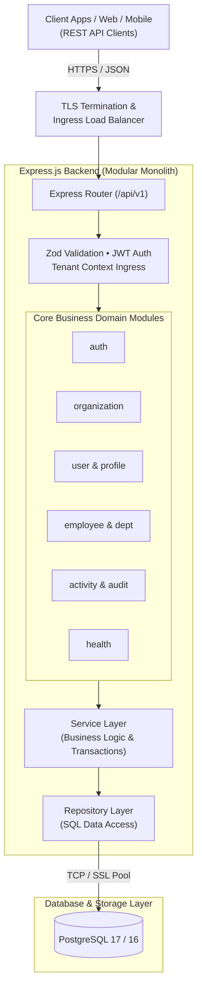
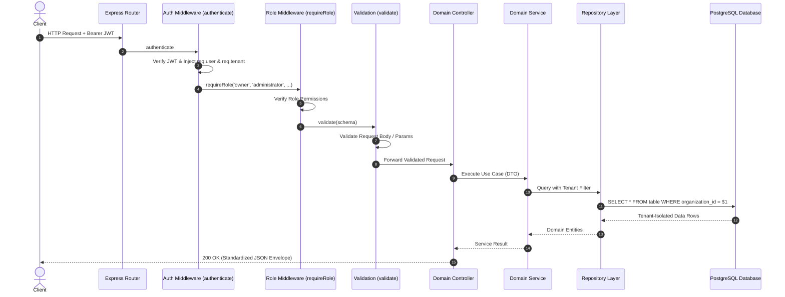
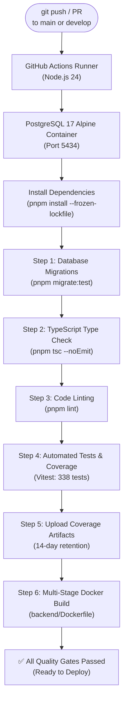

# Multi-Tenant SaaS HR Platform

> **Production-grade Backend API for modern multi-tenant Human Resources Management.**

A production-oriented backend application designed to demonstrate modern backend engineering practices using **TypeScript**, **Node.js**, **Express.js**, **PostgreSQL**, **Docker**, and **GitHub Actions**.

This project follows a **Modular Monolith Architecture** and is built with scalability, maintainability, and production readiness as primary goals rather than serving as a simple CRUD demonstration.

**Status**

- ✅ Active Development
- ✅ Backend API
- ✅ Multi-Tenant Architecture
- ✅ Production-ready Docker Environment
- ✅ Continuous Integration (GitHub Actions)
- ✅ Production Cloud Deployment

---

## Project Overview

The **Multi-Tenant SaaS HR Platform** is a production-oriented backend application that simulates a modern Human Resources platform used by multiple organizations within a single system.

Unlike traditional single-tenant applications, each organization operates within its own isolated workspace while sharing the same backend infrastructure. This architecture reflects how modern Software-as-a-Service (SaaS) products are designed and deployed in production environments.

The project was built as a long-term backend engineering portfolio to demonstrate software architecture, API design, database design, authentication, authorization, testing, containerization, continuous integration, and production deployment using modern backend technologies and engineering practices.

Rather than focusing solely on implementing business features, the project emphasizes maintainability, scalability, clean architecture, and production readiness throughout the entire development lifecycle.

---

## Key Features

### Multi-Tenant Architecture

- Organization-based data isolation
- Tenant-aware application design
- Shared infrastructure with logical tenant separation

### Authentication & Authorization

- JWT Access and Refresh Token authentication
- Role-Based Access Control (RBAC)
- Secure password hashing
- Protected API endpoints

### Employee Management

- Employee profile management
- Employment status management
- Employment information management

### Organization & User Management

- Multi-organization management
- Department structure and assignment
- User account and membership management

### Backend Engineering

- Modular Monolith Architecture
- Layered application design
- Request validation with Zod
- Centralized error handling
- Structured logging
- Database transaction support

### Infrastructure & DevOps

- Dockerized development environment
- Multi-stage production Docker image
- GitHub Actions Continuous Integration
- Automated Docker build verification
- Health check endpoint
- Environment-based configuration

### Database

- PostgreSQL
- SQL migrations
- UUID primary keys
- Referential integrity through foreign keys

### Testing & Quality

- Unit and integration testing with Vitest
- Automated coverage reporting
- ESLint with TypeScript-ESLint
- TypeScript strict mode

---

## System Architecture

The **Multi-Tenant SaaS HR Platform** follows a **Modular Monolith Architecture**, where the application is organized into independent business modules while remaining deployed as a single application.

This architectural approach provides clear module boundaries, simplifies development, and reduces operational complexity while allowing the system to evolve as new business capabilities are introduced.

### Architectural Principles

- Centralized Error Handling
- Request Validation using Zod
- Structured Logging
- Environment-based Configuration

### High-Level Architecture Overview



### Multi-Tenant Request Lifecycle



For a detailed explanation of the application architecture, module boundaries, request lifecycle, and design decisions, see **[System Architecture](docs/02-system-architecture.md)**.

---

## Technology Stack

| Category             | Technology             |
| -------------------- | ---------------------- |
| **Language**         | TypeScript             |
| **Runtime**          | Node.js                |
| **Framework**        | Express.js             |
| **Database**         | PostgreSQL             |
| **Database Driver**  | node-postgres (pg)     |
| **Validation**       | Zod                    |
| **Authentication**   | JSON Web Tokens (JWT)  |
| **Password Hashing** | Argon2                 |
| **Logging**          | Pino                   |
| **Testing**          | Vitest                 |
| **Package Manager**  | pnpm                   |
| **Containerization** | Docker, Docker Compose |
| **CI/CD**            | GitHub Actions         |

The project follows modern backend engineering practices, including strict TypeScript configuration, modular architecture, automated testing, containerized development, and continuous integration to support maintainable and production-ready software development.

---

## Documentation

The project documentation is organized into focused technical documents to improve readability and maintainability.

| Document                                              | Description                                                                     |
| ----------------------------------------------------- | ------------------------------------------------------------------------------- |
| [Project Overview](docs/01-project-overview.md)       | Business domain, project goals, and overall scope                               |
| [System Architecture](docs/02-system-architecture.md) | Application architecture, module organization, and request lifecycle            |
| [Database Design](docs/03-database-design.md)         | Entity relationships, database schema, and design decisions                     |
| [API Reference](docs/04-api-reference.md)             | REST API conventions, endpoints, request/response standards, and authentication |
| [Testing Strategy](docs/05-testing-strategy.md)       | Testing approach, project structure, and quality assurance practices            |
| [Docker Guide](docs/06-docker-guide.md)               | Local development, production containers, and Docker workflow                   |
| [CI/CD Pipeline](docs/07-ci-cd-pipeline.md)           | GitHub Actions workflow, automated validation, and Docker verification          |
| [Deployment Guide](docs/08-deployment-guide.md)       | Production deployment process and infrastructure configuration                  |
| [Development Roadmap](docs/09-development-roadmap.md) | Development phases, completed milestones, and future work                       |
| [Future Enhancements](docs/10-future-enhancements.md) | Planned improvements, scalability considerations, and long-term vision          |

---

## Repository Structure

```text
multi-tenant-saas-hr-platform/
│
├── .github/               # GitHub Actions workflows
│
├── assets/                # Images, diagrams, and project assets
│
├── backend/               # Backend application
│   ├── src/               # Application source code
│   ├── tests/             # Unit and integration tests
│   ├── database/          # Migrations, schema, and DB scripts
│   ├── coverage/          # Test coverage reports
│   ├── Dockerfile
│   └── package.json
│
├── docs/                  # Project documentation
│   ├── 01-project-overview.md
│   ├── 02-system-architecture.md
│   ├── 03-database-design.md
│   ├── 04-api-reference.md
│   ├── 05-testing-strategy.md
│   ├── 06-docker-guide.md
│   ├── 07-ci-cd-pipeline.md
│   ├── 08-deployment-guide.md
│   ├── 09-development-roadmap.md
│   └── 10-future-enhancements.md
│
├── .gitignore
├── docker-compose.yml
├── LICENSE
└── README.md
```

The repository is organized to separate application code, technical documentation, project assets, database migrations, automated tests, and infrastructure configuration. This structure promotes maintainability, scalability, and ease of navigation as the project evolves.

---

## Quick Start

### Prerequisites

Before running the project, ensure the following tools are installed:

- Node.js 24+
- pnpm 11.9.0
- Docker
- Docker Compose
- Git

### Clone the Repository

```bash
git clone https://github.com/m-aaron/multi-tenant-saas-hr-platform.git

cd multi-tenant-saas-hr-platform
```

### Install Dependencies

```bash
cd backend

pnpm install
```

### Configure Environment Variables

Create a local environment file from the provided example.

```bash
cd backend

cp .env.example .env
```

Update the environment variables as needed for your local development environment.

### Start the Development Environment

```bash
docker compose up --build
```

### Run Database Migrations

Migrations are run from the host machine against the Dockerized PostgreSQL instance. Ensure `backend/.env` contains `DATABASE_HOST=localhost` and `DATABASE_PORT=5434` before running:

```bash
cd backend

pnpm migrate
```

### Verify the API

After the application starts successfully, verify that the backend is running by visiting:

```text
http://localhost:4000/api/v1/health
```

A successful response should return:

```json
{
  "status": "ok",
  "database": "connected",
  "uptime": 44,
  "environment": "development"
}
```

> `uptime` is reported in seconds and reflects the server's current process uptime. Your value will differ.

For detailed setup instructions, Docker workflow, and troubleshooting, see the [Docker Guide](docs/06-docker-guide.md).

---

## Testing

The project includes automated testing and validation to help maintain code quality, reliability, and long-term maintainability throughout the development lifecycle.

### Run the Test Suite

```bash
cd backend

pnpm test
```

### Type Checking

```bash
cd backend

pnpm tsc --noEmit
```

### Linting

```bash
cd backend

pnpm lint
```

### Test Coverage

```bash
cd backend

pnpm test:coverage
```

Coverage reports are generated in the `backend/coverage/` directory.

### Continuous Integration

Every pull request and push to the `main` or `develop` branch is automatically validated through GitHub Actions, including:

- TypeScript type checking
- ESLint code quality validation
- Automated test execution with coverage reporting
- Coverage report artifact upload
- Docker image build verification

For detailed information about the project's testing approach, testing strategy, and quality assurance practices, see the [Testing Strategy](docs/05-testing-strategy.md).

---

## Docker

The project uses Docker to provide a consistent development and production environment, ensuring that the application behaves the same regardless of the host operating system.

### Development Environment

The recommended way to run the project locally is through Docker Compose.

```bash
docker compose up --build
```

This starts the complete development environment, including:

- Backend API
- PostgreSQL database
- Docker networking

For complete Docker documentation, container architecture, and troubleshooting, see the [Docker Guide](docs/06-docker-guide.md).

---

## CI/CD

The project uses **GitHub Actions** to automatically validate every code change, helping maintain code quality and ensuring the application remains buildable throughout development.

### Continuous Integration Pipeline

Every push and pull request to the `main` or `develop` branch automatically performs the following validation steps:



- Database migrations against isolated test container (`pnpm migrate:test`)
- TypeScript type checking (`pnpm tsc --noEmit`)
- ESLint code quality validation (`pnpm lint`)
- Automated test execution with coverage reporting (24 suites, 338 tests)
- Coverage report artifact upload (HTML/LCOV)
- Multi-stage Docker image build verification (`backend/Dockerfile`)

This automated workflow helps detect issues early, reduces integration problems, and ensures that every change meets the project's quality standards before being merged.

### Pipeline Goals

The CI pipeline is designed to provide:

- Automated quality assurance
- Fast developer feedback
- Consistent build verification
- Reliable Docker image validation
- Reproducible development workflow

For detailed information about the GitHub Actions workflow, pipeline stages, dependency caching, and Docker verification, see the [CI/CD Pipeline](docs/07-ci-cd-pipeline.md).

---

## Development Roadmap

The project is being developed through incremental engineering phases, with each phase focusing on a specific aspect of modern backend software development.

| Phase                          |    Status    |
| ------------------------------ | :----------: |
| Product Planning               | ✅ Completed |
| Project Setup                  | ✅ Completed |
| System Architecture            | ✅ Completed |
| Database Design                | ✅ Completed |
| Infrastructure Foundation      | ✅ Completed |
| Authentication & Authorization | ✅ Completed |
| Core HR Modules                | ✅ Completed |
| Validation & Error Handling    | ✅ Completed |
| Logging & Observability        | ✅ Completed |
| Automated Testing              | ✅ Completed |
| Code Quality                   | ✅ Completed |
| Continuous Integration         | ✅ Completed |
| Production Docker Environment  | ✅ Completed |
| Engineering Review             | ✅ Completed |
| Portfolio & Documentation      | ✅ Completed |
| Production Cloud Deployment    | ✅ Completed |

The roadmap reflects the project's engineering-first approach, where architecture, maintainability, testing, infrastructure, and deployment are treated as first-class concerns alongside business functionality.

See the complete development history and future milestones in the [Development Roadmap](docs/09-development-roadmap.md).

---

## Closing Statement

The **Multi-Tenant SaaS HR Platform** is under active development. See the [Development Roadmap](docs/09-development-roadmap.md) for upcoming milestones.

---

## License

This project is licensed under the **MIT License**.

See the [LICENSE](LICENSE) file for more information.
