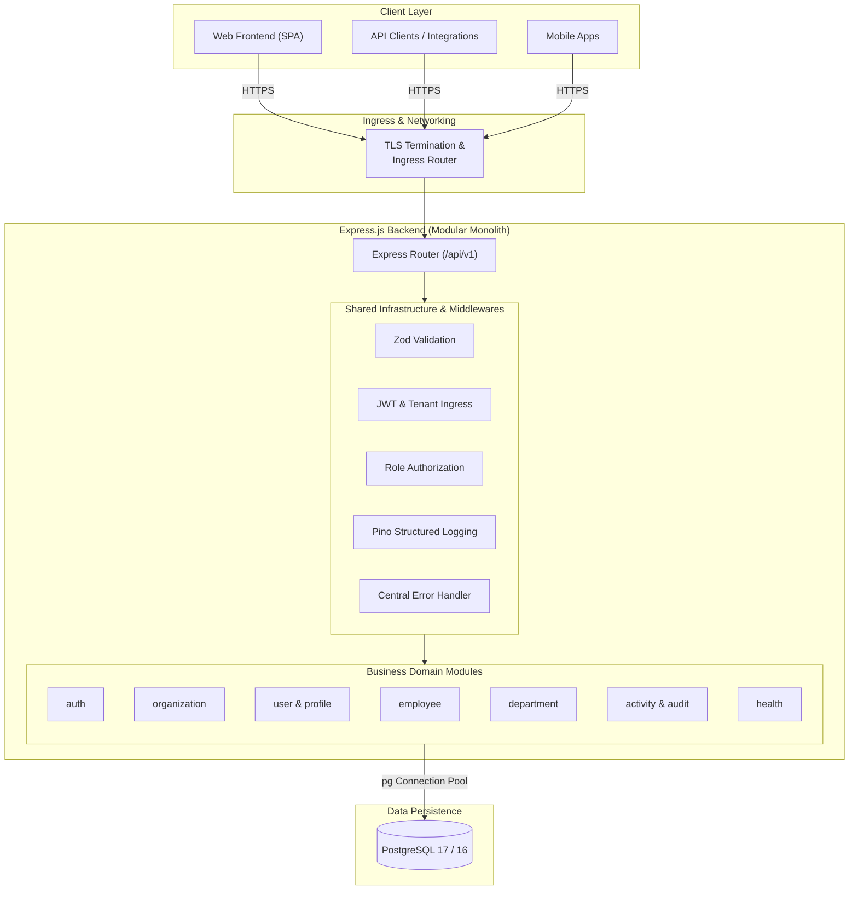
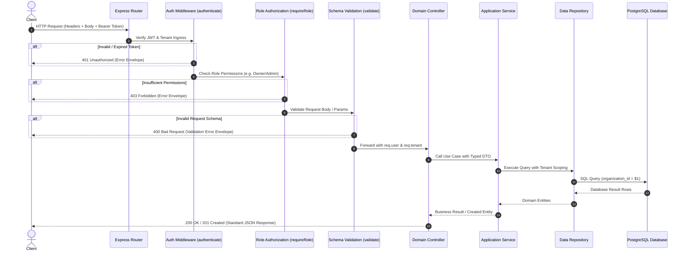

> **Multi-Tenant SaaS HR Platform Documentation**
>
> [01 Project Overview](./01-project-overview.md) • **[02 System Architecture](./02-system-architecture.md)** • [03 Database Design](./03-database-design.md) • [04 API Reference](./04-api-reference.md) • [05 Testing Strategy](./05-testing-strategy.md) • [06 Docker Guide](./06-docker-guide.md) • [07 CI/CD Pipeline](./07-ci-cd-pipeline.md) • [08 Deployment Guide](./08-deployment-guide.md) • [09 Development Roadmap](./09-development-roadmap.md) • [10 Future Enhancements](./10-future-enhancements.md)

---

# System Architecture

## Architecture Overview

The **Multi-Tenant SaaS HR Platform** is implemented as a **Modular Monolith** backend application designed around clean architectural boundaries, clear separation of responsibilities, and long-term maintainability.

Rather than organizing the codebase around technical components alone, the system is structured into independent business modules, each responsible for a specific domain within the application. This approach allows the platform to evolve incrementally while maintaining a cohesive and understandable architecture.

The application follows a layered architecture that separates business logic from infrastructure concerns. Requests flow through well-defined layers responsible for routing, validation, application services, domain logic, data persistence, and shared infrastructure. Cross-cutting concerns such as authentication, authorization, logging, configuration management, and error handling are implemented as reusable platform services rather than duplicated across individual modules.

The architecture is intentionally designed to balance simplicity and scalability. A Modular Monolith provides many of the organizational benefits associated with distributed systems while avoiding the operational complexity of microservices during the early stages of product development. This establishes a stable engineering foundation that can support future business growth and architectural evolution without premature optimization.

---

## Table of Contents

- [Architectural Principles](#architectural-principles)
- [High-Level System Architecture](#high-level-system-architecture)
- [Backend Architecture](#backend-architecture)
- [Module Organization](#module-organization)
- [Layered Architecture](#layered-architecture)
- [Request Lifecycle](#request-lifecycle)
- [Dependency Rules](#dependency-rules)
- [Shared Infrastructure](#shared-infrastructure)
- [Error Handling Strategy](#error-handling-strategy)
- [Logging Strategy](#logging-strategy)
- [Security Architecture](#security-architecture)
- [Scalability considerations](#scalability-considerations)
- [Architecture Decisions](#architecture-decisions)
- [Future Architecture Evolution](#future-architecture-evolution)
- [Document Index](#document-index)

---

## Architectural Principles

The architecture of the **Multi-Tenant SaaS HR Platform** is guided by a set of engineering principles that promote maintainability, scalability, consistency, and long-term software quality. These principles influence every architectural and implementation decision throughout the project.

### Separation of Concerns

Each layer and module is responsible for a single area of the application. Business logic, infrastructure, validation, routing, and data persistence are separated to reduce coupling and improve maintainability.

### Modular Design

The application is organized into independent business modules that encapsulate their own responsibilities while collaborating through well-defined interfaces. Modules are designed to evolve independently without introducing unnecessary dependencies.

### Single Responsibility Principle

Every component should have one primary responsibility. Controllers coordinate requests, services implement business rules, repositories manage data access, and shared infrastructure provides reusable platform capabilities.

### Dependency Direction

Dependencies flow inward toward the application's business logic. Higher-level business rules remain independent of implementation details such as databases, frameworks, or external infrastructure whenever practical.

### Simplicity Before Complexity

Architectural decisions prioritize clarity and maintainability over unnecessary abstraction. The project intentionally adopts a Modular Monolith architecture to avoid the operational complexity of distributed systems until business requirements justify additional architectural evolution.

### Consistency

Naming conventions, project structure, coding standards, API design, validation, error handling, and logging follow consistent patterns throughout the application to improve readability and reduce cognitive overhead for developers.

### Security by Design

Security is treated as a foundational architectural concern rather than an afterthought. Authentication, authorization, password protection, input validation, and tenant data isolation are integrated into the system design from the beginning.

### Incremental Evolution

The architecture is designed to support gradual expansion. New modules, business capabilities, and infrastructure improvements can be introduced without requiring significant restructuring of the existing codebase.

---

## High-Level System Architecture

The **Multi-Tenant SaaS HR Platform** follows a client-server architecture in which client applications communicate with a centralized backend service through RESTful APIs. The backend is responsible for enforcing business rules, authentication, authorization, tenant isolation, and data persistence.

At a high level, the system consists of the following components:

### Client Applications

Client applications, such as web-based frontends or API clients, communicate with the backend through HTTP-based REST APIs. They are responsible for presenting data to end users and collecting user input while delegating business logic to the backend.

### Backend Application

The backend serves as the core of the platform. It processes incoming requests, validates data, applies business rules, enforces security policies, coordinates application modules, and manages communication with the database.

### PostgreSQL Database

PostgreSQL serves as the primary relational database for the platform. It stores tenant, user, employee, department, authentication, and other business data while supporting transactional consistency and long-term scalability.

### Docker Environment

Docker provides a consistent execution environment across development and future deployment environments. Containerization ensures that the application and its dependencies behave consistently regardless of the underlying operating system.

### Continuous Integration

GitHub Actions automatically verifies the quality of the codebase by performing build validation and other automated checks whenever changes are pushed to the repository.

### High-Level Component Interaction



The overall request flow can be summarized as follows:

1. A client application sends an HTTP request to the backend.
2. The backend validates the request and authenticates the user when required.
3. The appropriate business module processes the request according to the application's business rules.
4. The backend retrieves or persists data in PostgreSQL as needed.
5. The backend returns a standardized HTTP response to the client.

GitHub Actions operates independently of the runtime request cycle, continuously validating the integrity of the codebase throughout the development lifecycle.

---

## Backend Architecture

The backend application is designed as a **Modular Monolith** that combines independent business modules with a shared application infrastructure. Each module encapsulates a specific business capability while following consistent architectural conventions across the entire codebase.

Rather than organizing the application solely by technical components, the backend is structured around business domains. This approach promotes maintainability, improves code discoverability, and reduces unnecessary coupling between unrelated areas of the system.

At a high level, the backend consists of three primary architectural areas:

### Business Modules

Business modules implement the application's core domain logic. Each module owns its own business rules, request handling, data access, validation, and internal implementation while collaborating with other modules through clearly defined interfaces.

The platform is organized into the following business modules:

- Authentication
- Organization Management
- Department Management
- Employee Management
- User Management
- Profile Management
- Role Management
- Session Management
- Activity Logging
- Audit Logging

### Shared Infrastructure

Common platform capabilities are centralized within a shared infrastructure layer. These components provide reusable services that support every business module without duplicating implementation.

Shared infrastructure includes:

- Configuration management
- Database connectivity
- Request validation
- Error handling
- Structured logging
- Authentication middleware
- Authorization middleware
- Shared utilities

### External Dependencies

The backend communicates with external systems only through controlled infrastructure components. These dependencies include PostgreSQL for persistent data storage, Docker for containerized execution, and GitHub Actions for automated build verification.

By separating business modules, shared infrastructure, and external dependencies, the backend maintains a clean architectural structure that supports long-term maintainability, incremental feature development, and future architectural evolution.

---

## Module Organization

The backend is organized into independent business modules following the principles of a **Modular Monolith Architecture**. Each module represents a distinct business domain and encapsulates its own responsibilities, allowing the application to grow while maintaining clear architectural boundaries.

Every module is designed to be cohesive, self-contained, and responsible for a specific area of the business. Internal implementation details remain private to the module, while interactions with other modules occur only through well-defined interfaces.

The platform is currently composed of the following core modules:

### Authentication Module

Responsible for user registration, login, logout, password security, and JSON Web Token (JWT) issuance. Authentication middleware enforces identity verification across all protected API endpoints.

### Organization Module

Responsible for tenant organization management, organizational configuration, and maintaining tenant boundaries throughout the platform.

### Department Module

Responsible for managing organizational departments and the relationships between departments and employees.

### Employee Module

Responsible for employee information, employment records, and employee-related business operations.

### User Module

Responsible for platform user accounts, account lifecycle management, and the relationship between authenticated users and their corresponding records within the system.

### Profile Module

Responsible for personal profile information associated with platform users, providing a dedicated layer for user-specific data separate from authentication account details.

### Role Module

Responsible for managing the roles available within the system. Roles define the permission sets that control what actions users are authorized to perform within their organization. Role-Based Access Control (RBAC) enforcement is applied at the middleware layer.

### Session Module

Responsible for managing authenticated user sessions and the lifecycle of refresh tokens. Session records are stored server-side in the database to support secure token rotation and revocation.

### Activity Module

Responsible for recording user activity events across the platform, providing an operational log that supports visibility into system usage within each organization.

### Audit Module

Responsible for tracking data change events for accountability and traceability, providing a record of significant operations performed within the system.

### Module Interaction Principles

To preserve architectural integrity, every module follows the following rules:

- Each module owns its own business logic and data responsibilities.
- Modules communicate through explicit interfaces rather than accessing another module's internal implementation directly.
- Business rules remain inside the module that owns the corresponding business domain.
- Shared functionality is implemented within the shared infrastructure layer instead of being duplicated across multiple modules.
- Circular dependencies between modules are avoided to maintain clear dependency direction.

This organization enables the backend to remain maintainable, scalable, and understandable as additional business capabilities are introduced over time.

---

## Layered Architecture

Each business module follows a consistent layered architecture that separates request handling, business logic, data access, and infrastructure concerns. This separation improves maintainability, testability, and readability while encouraging clear ownership of responsibilities throughout the application.

The backend is organized into the following logical layers:

### Presentation Layer

The Presentation Layer is responsible for receiving HTTP requests, validating incoming data, invoking the appropriate application services, and returning standardized HTTP responses. This layer contains controllers, route definitions, and request validation.

Responsibilities include:

- HTTP request handling
- Request validation
- Response formatting
- Invoking application services

### Application Layer

The Application Layer coordinates application workflows and implements business use cases. It orchestrates operations across the module while remaining independent of HTTP-specific concerns.

Responsibilities include:

- Business use case execution
- Transaction coordination
- Application workflow orchestration
- Communication with repositories and shared services

### Data Access Layer

The Data Access Layer is responsible for interacting with PostgreSQL. It encapsulates all persistence logic and provides a consistent interface for retrieving and storing application data.

Responsibilities include:

- Database queries
- Data persistence
- Data retrieval
- Transaction support

### Shared Infrastructure Layer

The Shared Infrastructure Layer provides reusable platform services that are shared across all business modules. These services support the application without containing business-specific logic.

Examples include:

- Database connection management
- Configuration management
- Authentication middleware
- Authorization middleware
- Logging
- Error handling
- Utility functions

### Layer Interaction

Each layer has a clearly defined responsibility and communicates only with the layers directly beneath it.

The typical dependency flow is:

```
Presentation Layer
       │
       ▼
Application Layer
       │
       ▼
Data Access Layer
       │
       ▼
PostgreSQL
```

Cross-cutting services provided by the Shared Infrastructure Layer are available to all modules while remaining independent of individual business domains.

This layered organization improves maintainability, encourages separation of concerns, and supports long-term evolution of the application without tightly coupling business logic to infrastructure or transport mechanisms.

---

## Request Lifecycle

Every client request follows a consistent processing pipeline designed to ensure security, validation, maintainability, and predictable application behavior. The request passes through multiple architectural layers before a response is returned to the client.



The typical request lifecycle is as follows:

### 1. Client Request

A client application sends an HTTP request to one of the platform's REST API endpoints.

### 2. Route Resolution

The **Express.js** routing layer identifies the appropriate endpoint and forwards the request through the registered middleware pipeline.

### 3. Authentication

For protected endpoints, the `authenticate` middleware verifies the user's identity using a JSON Web Token (JWT) and extracts the `userId`, `organizationId`, and `role` into `req.user`.

### 4. Authorization

When required, the `requireRole` authorization middleware verifies that the authenticated user has sufficient permissions to perform the requested operation based on the platform's Role-Based Access Control (RBAC) model.

### 5. Request Validation

Incoming request body, query parameters, and route parameters are validated using **Zod** schemas. Invalid requests are rejected immediately with standardized validation responses before reaching the controller.

### 6. Controller Execution

The controller receives the validated request and delegates the operation to the appropriate application service. Controllers remain lightweight and do not contain business logic.

### 7. Application Service

The application service executes the requested business use case. It applies business rules, coordinates workflows, and communicates with repositories or shared infrastructure when necessary.

### 8. Data Access

Repositories interact with PostgreSQL to retrieve, update, insert, or delete data while encapsulating all database-specific operations.

### 9. Response Generation

The application service returns the operation result to the controller, which formats a standardized HTTP response before sending it back to the client.

### 10. Logging and Error Handling

Throughout the request lifecycle, centralized logging and error handling capture operational information and convert unexpected failures into consistent API responses without exposing internal implementation details.

### Request Flow Summary

The overall request lifecycle can be summarized as follows:

```
Client
  │
  ▼
Express Router
  │
  ▼
Validation (Zod)
  │
  ▼
Authentication Middleware (JWT)
  │
  ▼
Authorization Middleware (RBAC)
  │
  ▼
Controller
  │
  ▼
Application Service
  │
  ▼
Repository
  │
  ▼
PostgreSQL
  │
  ▼
Repository
  │
  ▼
Application Service
  │
  ▼
Controller
  │
  ▼
HTTP Response
```

---

## Dependency Rules

To preserve the integrity of the Modular Monolith architecture, the backend follows a set of dependency rules that define how layers and modules may interact. These rules promote loose coupling, maintainability, and long-term architectural consistency as the application evolves.

### Layer Dependencies

Dependencies follow a single direction through the application layers:

```
Presentation Layer
       │
       ▼
Application Layer
       │
       ▼
Data Access Layer
       │
       ▼
PostgreSQL
```

Higher layers may depend on lower layers, but lower layers must never depend on higher layers.

### Module Independence

Each business module owns its internal implementation and should remain independent of other modules whenever possible. Modules interact only through explicit interfaces or well-defined application boundaries.

Modules must not directly access another module's internal implementation details.

### Shared Infrastructure

Reusable platform services are centralized within the shared infrastructure layer.

Business modules may depend on shared infrastructure components such as:

- Configuration management
- Database connectivity
- Logging
- Error handling
- Authentication middleware
- Authorization middleware
- Shared utilities

Shared infrastructure must not contain business-specific logic or become tightly coupled to any individual module.

### Business Logic Ownership

Business rules always belong to the module responsible for the corresponding business domain.

For example:

- Employee-related business rules belong to the Employee Module.
- Organization-specific rules belong to the Organization Module.

Business logic should never be duplicated across multiple modules.

### Circular Dependency Prevention

Circular dependencies between modules are prohibited.

Each dependency relationship should remain unidirectional to simplify maintenance, reduce coupling, and improve code readability.

### External Dependency Isolation

Communication with external systems such as PostgreSQL and other infrastructure services should be encapsulated behind repositories or shared infrastructure components.

Business modules should remain independent of implementation details whenever practical.

These dependency rules establish clear architectural boundaries that support maintainability, scalability, and consistent software evolution throughout the project lifecycle.

---

## Shared Infrastructure

The backend provides a centralized shared infrastructure layer that contains reusable platform services used across all business modules. These components implement cross-cutting concerns that are common throughout the application while remaining independent of any specific business domain.

Centralizing these capabilities promotes consistency, reduces duplication, and simplifies long-term maintenance of the codebase.

The shared infrastructure currently includes the following categories of services:

### Configuration Management

Provides centralized access to application configuration, environment variables, and runtime settings. This ensures that configuration is managed consistently throughout the application.

### Database Connectivity

Manages the application's connection to PostgreSQL and provides shared database access utilities that are reused across repositories.

### Request Validation

Provides reusable request validation using **Zod**, which enforces schema-based input validation to ensure incoming data satisfies expected schemas before business logic is executed.

### Authentication

Provides reusable authentication middleware responsible for verifying user identity and protecting secured API endpoints using JSON Web Tokens (JWT).

### Authorization

Provides reusable authorization middleware that enforces Role-Based Access Control (RBAC) policies across protected resources.

### Error Handling

Provides centralized exception handling and standardized API error responses to ensure consistent behavior throughout the application.

### Structured Logging

Provides a shared logging service implemented using **Pino** for recording application events, warnings, operational information, and unexpected failures in a structured JSON format.

### Shared Utilities

Provides reusable helper functions and common utilities that are independent of any specific business module and support the application as a whole.

### Infrastructure Design Principles

The shared infrastructure layer follows several architectural principles:

- Shared infrastructure must remain independent of business-specific logic.
- Infrastructure services should be reusable across multiple business modules.
- Platform capabilities should be implemented once and reused consistently throughout the application.
- Business modules should depend on shared infrastructure when appropriate, while shared infrastructure must not depend on business modules.

This separation ensures that business modules remain focused on implementing business rules while infrastructure components provide common technical capabilities for the entire platform.

---

## Error Handling Strategy

The backend implements a centralized error handling strategy to ensure that application failures are managed consistently across all business modules. Rather than allowing individual modules to define their own error handling behavior, all errors follow a standardized processing pipeline before an HTTP response is returned to the client.

The primary objectives of this strategy are to provide predictable API behavior, improve maintainability, simplify debugging, and prevent exposure of internal implementation details.

### Centralized Error Handling

Application errors are processed through a centralized error handling mechanism that converts exceptions into standardized HTTP responses.

This approach ensures that:

- API responses remain consistent across all endpoints.
- Unexpected failures are handled gracefully.
- Internal implementation details are not exposed to clients.
- Error handling logic is implemented once and reused throughout the application.

### Error Classification

Errors are generally classified into the following categories:

#### Validation Errors

Generated when incoming request data does not satisfy the expected validation rules.

Typical examples include:

- Missing required fields
- Invalid data formats
- Schema validation failures

#### Authentication Errors

Generated when user identity cannot be verified.

Typical examples include:

- Missing authentication token
- Invalid token
- Expired token

#### Authorization Errors

Generated when an authenticated user attempts to access resources without sufficient permissions.

#### Business Rule Errors

Generated when business rules prevent an operation from being completed.

Examples include business-specific validation failures or operations that violate application rules.

#### Infrastructure Errors

Generated when failures occur outside the application's business logic, such as database connectivity problems or unexpected infrastructure failures.

### Standardized Error Responses

The backend returns consistent error responses using appropriate HTTP status codes together with structured response bodies. This allows client applications to handle failures in a predictable manner regardless of the originating module.

### Secure Error Reporting

Internal implementation details, stack traces, database information, and sensitive system data are never exposed through public API responses.

Detailed diagnostic information is retained within application logs for operational troubleshooting while clients receive only the information necessary to understand the failure.

### Error Propagation

Errors are propagated through the application's architectural layers until they reach the centralized error handling mechanism. Individual modules remain focused on business logic rather than generating HTTP responses directly for exceptional situations.

This approach maintains clear separation of concerns while ensuring consistent application behavior across the entire platform.

---

## Logging Strategy

The backend implements a centralized structured logging strategy to provide consistent operational visibility across the entire application. Logging is treated as a core infrastructure capability that supports debugging, monitoring, troubleshooting, and long-term maintainability.

Rather than allowing each module to implement its own logging approach, the platform provides a shared logging service, implemented using **Pino**, that is reused consistently throughout the application.

### Logging Objectives

The logging strategy is designed to:

- Record important application events.
- Simplify debugging and issue investigation.
- Support operational monitoring.
- Improve production troubleshooting.
- Maintain consistent log formatting across all modules.

### Structured Logging

Application logs follow a structured JSON format that enables both human readability and machine processing. Structured logs improve filtering, searching, aggregation, and integration with monitoring platforms.

Each log entry should include relevant contextual information whenever appropriate, such as:

- Timestamp
- Log level
- Request identifier
- Module or service name
- Operation being performed
- Error information (when applicable)

### Log Levels

The application categorizes log entries according to their purpose:

#### Debug

Detailed diagnostic information intended for development and troubleshooting.

#### Info

Records normal application operations such as successful requests, startup events, and significant business operations.

#### Warning

Indicates unexpected situations that do not prevent the application from continuing normal execution but may require future investigation.

#### Error

Records failures that prevent an operation from completing successfully while allowing the application to continue serving requests whenever possible.

### Security Considerations

Logs must never expose sensitive information, including:

- Passwords
- Authentication tokens
- Secrets
- Database credentials
- Personally identifiable information beyond what is operationally necessary

Sensitive data should be excluded, masked, or sanitized before being written to application logs.

### Centralized Logging

Business modules do not implement their own logging mechanisms. Instead, they rely on the shared logging infrastructure to ensure consistent formatting, behavior, and operational visibility across the entire platform.

This centralized approach reduces duplication, improves maintainability, and ensures that logging remains consistent as the application grows.

---

## Security Architecture

Security is incorporated into the architecture as a foundational design principle rather than an isolated feature. Multiple security mechanisms work together throughout the request lifecycle to protect user identities, application resources, and tenant data.

The platform follows a **defense-in-depth** approach in which security is enforced at multiple architectural layers rather than relying on a single protection mechanism.

### Authentication

User identity is verified using JSON Web Tokens (JWT). Protected endpoints require successful authentication before any business logic is executed.

Authentication responsibilities include:

- User identity verification
- Access token validation
- Secure session establishment
- Protection of authenticated API endpoints

### Authorization

The platform implements **Role-Based Access Control (RBAC)** to determine which operations an authenticated user is permitted to perform.

Authorization decisions are evaluated independently from authentication, ensuring that identity verification and permission enforcement remain separate architectural concerns.

### Tenant Isolation

As a multi-tenant SaaS platform, the application enforces logical isolation between organizations.

Every business operation is performed within the context of a tenant, preventing users from accessing resources that belong to other organizations.

Tenant isolation is considered a core architectural requirement rather than an application feature.

### Password Security

User passwords are never stored in plain text.

Passwords are securely hashed using **Argon2** before persistence, ensuring that credential storage follows modern security practices.

### Request Validation

Incoming requests are validated using **Zod** before reaching business logic.

Validation protects the application against malformed or unexpected input while ensuring that business services operate only on trusted and correctly structured data.

### Centralized Error Handling

Application errors are returned using standardized responses that avoid exposing sensitive implementation details such as stack traces, database information, or internal application structure.

Detailed diagnostic information is retained within application logs for operational troubleshooting.

### Secure Logging

Operational logs intentionally exclude sensitive information such as passwords, authentication tokens, secrets, and confidential configuration values.

Logging is designed to support operational visibility without compromising application security.

### Principle of Least Privilege

Users receive only the permissions required to perform their assigned responsibilities.

Application components similarly operate within clearly defined responsibilities, reducing unnecessary access throughout the system.

### Defense in Depth

The platform combines multiple complementary security controls throughout the request lifecycle, including:

- Request validation
- Authentication
- Authorization
- Tenant isolation
- Password hashing
- Centralized error handling
- Secure logging

By distributing security responsibilities across multiple architectural layers, the application reduces reliance on any single security mechanism and improves overall resilience against common implementation errors.

---

## Scalability Considerations

The **Multi-Tenant SaaS HR Platform** is designed with long-term scalability in mind. While the current implementation focuses on establishing a maintainable and production-ready backend foundation, several architectural decisions support future growth as business requirements evolve.

Rather than optimizing prematurely, the platform adopts a pragmatic approach in which architectural complexity is introduced only when justified by real operational needs.

### Modular Monolith Foundation

The application is implemented as a Modular Monolith, allowing business capabilities to evolve independently while maintaining a single deployable application.

This architecture provides clear module boundaries that simplify future expansion and reduce the effort required to introduce new business domains.

### Authentication Model

The backend uses a hybrid authentication model designed to balance stateless request processing with secure session management.

**Access tokens** (JWT) are short-lived and validated without server-side lookup, enabling stateless processing for authenticated requests and supporting horizontal scalability.

**Refresh tokens** are stored server-side in the `sessions` table, supporting token rotation and revocation. This hybrid approach enables horizontal scalability for access token validation while retaining the ability to invalidate sessions centrally when required.

### Database Design

The PostgreSQL database follows a normalized relational design that supports data consistency while remaining extensible for future business requirements.

Indexes, constraints, and transactional integrity provide a solid foundation for future performance optimization as application usage increases.

### Layered Architecture

The separation between presentation, application, data access, and shared infrastructure simplifies future optimization efforts by allowing individual layers to evolve without requiring significant changes throughout the application.

### Module Isolation

Business modules encapsulate their own responsibilities and internal implementation.

This isolation enables the platform to introduce new modules, modify existing functionality, or refactor individual business domains with minimal impact on unrelated areas of the application.

### Containerized Execution

Docker provides a consistent execution environment that simplifies deployment across different infrastructure environments and supports future horizontal scaling strategies.

### Continuous Integration

Automated build verification through GitHub Actions helps maintain architectural quality as the codebase grows by detecting integration issues early in the development process.

### Future Scalability

As the platform evolves, additional scalability improvements may be introduced, including:

- Performance optimization
- Caching strategies
- Background job processing
- Database optimization
- Load balancing
- Cloud-native deployment
- Monitoring and observability improvements

These capabilities are intentionally deferred until they become necessary, allowing the architecture to remain simple, maintainable, and aligned with actual business requirements.

The current architecture prioritizes maintainability, consistency, and clean architectural boundaries as the foundation upon which future scalability can be built.

---

## Architectural Decisions

The architecture of the **Multi-Tenant SaaS HR Platform** is the result of deliberate engineering decisions intended to balance maintainability, scalability, development velocity, and operational simplicity.

The following decisions establish the architectural foundation of the platform.

### Modular Monolith

**Decision**

Implement the backend as a Modular Monolith.

**Rationale**

A Modular Monolith provides strong architectural boundaries between business domains while avoiding the operational complexity associated with microservices. This approach supports rapid development, simpler deployment, and easier debugging during the early stages of product development.

**Trade-off**

The application is deployed as a single unit. If future business requirements justify distributed services, the existing module boundaries provide a foundation for gradual architectural evolution.

---

### REST API

**Decision**

Expose application functionality through RESTful HTTP APIs.

**Rationale**

REST provides a mature, widely adopted, and technology-independent communication model that is well suited for business applications and integration with web and API clients.

**Trade-off**

REST may require multiple requests for complex client interactions compared with alternative API styles, but its simplicity and broad ecosystem support make it an appropriate architectural choice for the platform.

---

### Express.js

**Decision**

Use **Express.js (v5)** as the web framework for the backend application.

**Rationale**

Express.js provides a minimal, flexible, and widely adopted HTTP framework for Node.js. It supports middleware composition, flexible routing, and a large ecosystem of integrations, including Helmet for security headers, CORS handling, and body parsing, without imposing unnecessary architectural constraints.

Express v5 introduces improved async error propagation compared with v4, reducing boilerplate in async route handlers and simplifying centralized error handling.

**Trade-off**

Express.js is intentionally unopinionated, which places responsibility for architectural structure on the developer. This is addressed through the project's enforced module boundaries, layered architecture, and consistent coding standards rather than framework-imposed conventions.

---

### PostgreSQL

**Decision**

Use PostgreSQL as the primary relational database.

**Rationale**

PostgreSQL provides strong transactional consistency, robust relational modeling, advanced indexing capabilities, and long-term scalability for business applications.

**Trade-off**

A relational database requires careful schema design and migration management, but these characteristics align well with the platform's structured business data.

---

### TypeScript

**Decision**

Develop the backend using TypeScript.

**Rationale**

Static typing improves maintainability, developer productivity, refactoring safety, and long-term code quality for medium-to-large backend applications.

**Trade-off**

TypeScript introduces additional compilation and type maintenance, but these costs are outweighed by improved reliability and developer experience.

---

### Docker

**Decision**

Standardize development and deployment environments using Docker.

**Rationale**

Containerization provides consistent execution environments across development, testing, and future production infrastructure while simplifying onboarding and deployment workflows.

**Trade-off**

Docker introduces additional tooling and configuration, but significantly improves environment consistency and deployment portability.

---

### Layered Architecture

**Decision**

Organize each business module using a layered architecture.

**Rationale**

Separating request handling, business logic, data access, and shared infrastructure improves maintainability, testability, and separation of concerns.

**Trade-off**

Layered architectures introduce additional abstraction compared with simpler CRUD applications, but they provide a stronger long-term foundation as the application grows.

---

### Engineering Philosophy

Across all architectural decisions, the project consistently prioritizes:

- Simplicity before unnecessary complexity
- Maintainability over premature optimization
- Clear architectural boundaries
- Consistent engineering practices
- Incremental evolution based on real business requirements

These principles guide future architectural decisions and help ensure that the platform continues to evolve in a predictable and sustainable manner.

---

## Future Architecture Evolution

The current architecture establishes a maintainable and production-ready foundation while intentionally remaining simple enough to support rapid development. As business requirements evolve, the architecture is designed to accommodate additional capabilities without requiring a complete redesign.

Future architectural evolution will be guided by the same engineering principles documented throughout this project, including modularity, maintainability, simplicity, and incremental improvement.

Potential areas of architectural evolution include:

### Background Job Processing

Long-running operations may be moved to asynchronous background workers to improve responsiveness and reduce request latency for client applications.

Examples include:

- Email delivery
- Report generation
- Scheduled tasks
- Data synchronization

### Caching

Caching strategies may be introduced to reduce database load and improve response times for frequently accessed or computationally expensive data.

Caching will be adopted only where measurable performance benefits justify the additional operational complexity.

### Observability

Operational visibility may be enhanced through additional monitoring and observability capabilities, including:

- Metrics collection
- Distributed tracing
- Health monitoring
- Performance dashboards
- Centralized log aggregation

### Infrastructure Scaling

As application demand increases, the deployment architecture may evolve to support multiple application instances, load balancing, and cloud-native infrastructure. The hybrid JWT/session authentication model supports horizontal scaling for access token validation while maintaining centralized session management.

### Database Optimization

Future database improvements may include:

- Query optimization
- Advanced indexing strategies
- Read replicas
- Database partitioning
- Performance tuning

These optimizations will be driven by production usage patterns rather than speculative requirements.

### Architectural Decomposition

The Modular Monolith architecture intentionally establishes clear business boundaries between modules.

If future operational requirements justify greater system decomposition, selected modules may be extracted into independent services with minimal disruption due to the existing architectural separation.

Such a transition would be considered only when supported by measurable business or operational needs.

### Guiding Philosophy

The architecture is expected to evolve gradually rather than through large-scale rewrites.

Every architectural decision should continue to follow the project's core engineering principles:

- Simplicity before complexity
- Incremental evolution
- Clear architectural boundaries
- Maintainability over premature optimization
- Business requirements driving technical decisions

By preserving these principles, the platform can continue to grow while maintaining a clean, understandable, and sustainable architecture.

---

## Document Index

This document is part of the **Multi-Tenant SaaS HR Platform** technical documentation suite:

| Document                                                | Description                                                      |
| :------------------------------------------------------ | :--------------------------------------------------------------- |
| [01 — Project Overview](./01-project-overview.md)       | Business domain, multi-tenancy model, and system scope           |
| **02 — System Architecture** _(this document)_          | Layered modular architecture, request lifecycle, and security    |
| [03 — Database Design](./03-database-design.md)         | Relational PostgreSQL schema, indexes, and tenant isolation      |
| [04 — API Reference](./04-api-reference.md)             | REST API conventions, endpoints, request/response specifications |
| [05 — Testing Strategy](./05-testing-strategy.md)       | Test hierarchy, domain coverage, and QA verification             |
| [06 — Docker Guide](./06-docker-guide.md)               | Multi-stage Docker packaging, Compose, and container security    |
| [07 — CI/CD Pipeline](./07-ci-cd-pipeline.md)           | GitHub Actions CI, 5-layer quality gates, and cloud deployment   |
| [08 — Deployment Guide](./08-deployment-guide.md)       | Production cloud deployment, database hosting, and monitoring    |
| [09 — Development Roadmap](./09-development-roadmap.md) | Development phases, completed milestones, and future work        |
| [10 — Future Enhancements](./10-future-enhancements.md) | Enterprise roadmap, Redis caching, microservices, and AI         |
